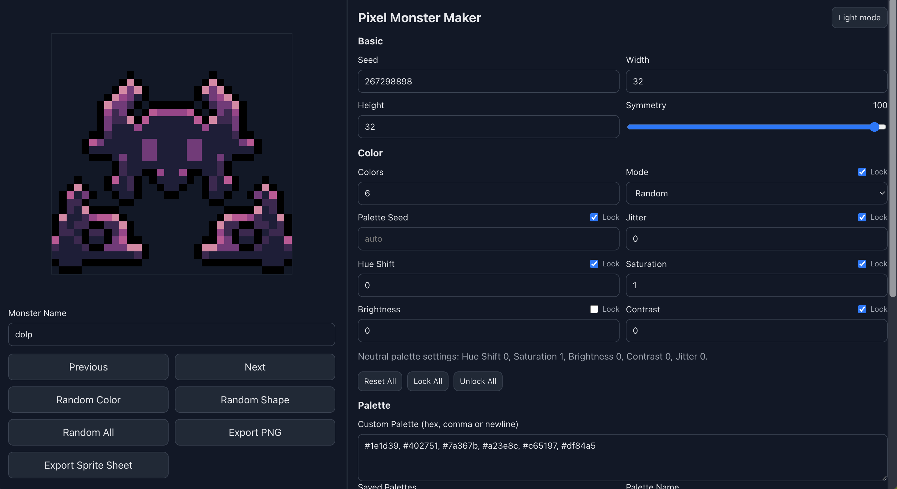
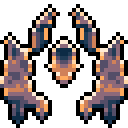

# Pixel Monster Maker

Standalone browser-native monster sprite generator for static hosting.

## Preview

<p align="center">
	
</p>

<p align="center">
	
	
	
</p>

## Stack

- TypeScript
- Vite
- HTML/CSS
- Canvas 2D

## Development

```bash
npm install
npm run dev
```

Open the local URL shown by Vite (default `http://localhost:5173`).

## Local testing (recommended workflow)

1) Fast feedback

```bash
npm run dev
```

2) Strict checks before push

```bash
npm run check
```

3) Production smoke test

```bash
npm run build
npm run preview
```

Manual smoke checklist:
- Generate with multiple seeds and confirm output changes.
- Verify `Previous`/`Next` navigation.
- Validate custom palette save/apply/delete.
- Validate PNG export and sprite-sheet export naming.
- Validate dark/light mode persistence.

## Build

```bash
npm run build
npm run preview
```

## GitHub Pages

- Workflow: [.github/workflows/deploy-pages.yml](.github/workflows/deploy-pages.yml)
- On push to `main`, the app builds and deploys to Pages.
- `VITE_BASE_PATH` is set automatically to `/<repo-name>/` in CI.

## Project structure

- [src/core](src/core): core generation algorithm modules
- [src/render.ts](src/render.ts): canvas renderer and export helpers
- [src/main.ts](src/main.ts): UI wiring and app state
- [docs/ALGORITHM.md](docs/ALGORITHM.md): algorithm and determinism notes
- [docs/media](docs/media): README media assets

## License

- MIT License: [LICENSE](LICENSE)
- Includes attribution notice for algorithm inspiration from Deep-Fold's MIT-licensed work.

